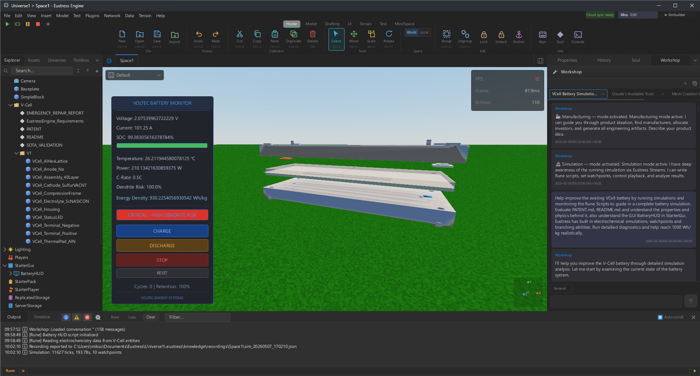

# Eustress Engine

> **The platform Roblox should have been.** A universal world-model engine — open source, forkable, AI- and MCP-native, photoreal — built to **simulate the world, not just render a scene.**

<p align="center">
  
</p>

<p align="center"><em>The Eustress Engine studio in action — a native Bevy 3D viewport running a live <strong>V-Cell</strong> battery-monitor simulation, alongside the scene Explorer, real-time Properties, and the built-in <strong>AI Workshop</strong> assistant, all in a single Rust + Slint window.</em></p>

## What it is

Eustress is **not (only) a game engine.** It's a general-purpose **simulation and proof-of-work substrate** that anything can be built on: AI model training, manufacturing dashboards, financial-market visualization, government and justice systems, kernel-law science validation, life-science research — and games as one use case among many. If you can model it, you can build it inside Eustress.

The whole project rests on one bet: **the engine actually simulates the world** rather than rendering a pretty scene. If that holds, Eustress is infrastructure and games are merely the on-ramp.

## Why it's different

- **Simulation-first.** Built to drive millions of entities under real kernel-level laws — the design target is order-of-*a-year-of-simulation-per-second* throughput, not just frames on screen.
- **Open source & forkable.** Closed source kills the moat; an open community ships faster. Fork it, embed it, rewrite it.
- **AI-native.** A built-in **Workshop** AI assistant plus a **Model Context Protocol (MCP)** bridge let AI agents inspect, drive, and build inside a *live* world — even from their own independent off-screen camera, so the AI can *see* what it is making and iterate alongside you.
- **Kernel laws — the gold-collar unlock.** Engineers and scientists can rewrite how the engine processes physics, chemistry, and more *at the kernel level* to validate their **own** simulations (e.g. the bundled V-Cell solid-state-battery model). Lose this and it is just a game engine; this is *the* unlock.
- **Photoreal & native.** One Rust window: a native **Bevy** 3D viewport with a declarative **Slint** UI overlay — no web stack, no IPC, no overhead.

## Architecture

| Layer | Choice |
|---|---|
| Language | 100% Rust |
| Render core | Bevy 0.18 |
| UI | Slint (declarative, native) |
| Physics | Avian |
| World store | Binary, log-structured **WorldDb** on [Fjall](https://github.com/fjall-rs/fjall) (LSM-tree) — live entity state as compact records, so a world scales to millions of entities and loads fast |
| Platforms | Desktop (Windows, macOS, Linux); mobile player in progress |

Eustress is a Rust monorepo. The most important crates (`eustress/crates/`):

| Crate | Role |
|---|---|
| `engine` | Desktop 3D editor / studio — viewport, Explorer, Properties, build & transform tools |
| `client` · `player-mobile` | Generative player / renderer |
| `common` | Shared scene format, instance classes, services, units, and realism / kernel laws |
| `worlddb` · `eustress-fjall` | Binary simulation store (the Fjall LSM-tree `WorldDb`) |
| `mcp` · `mcp-server` | Model Context Protocol — lets AI inspect and drive the live engine |
| `workshop` | Built-in AI Workshop assistant |
| `cad` | CAD / B-rep kernel (via `truck`) |
| `mesh-edit` | Half-edge mesh editing (extrude, inset, …) |
| `embedvec` · `spatial-llm` | Vector + spatial AI |
| `stream` · `stream-node` | Real-time streaming |
| `bliss` · `identity` · `server` · `web` | Economy, identity, backend, and web surfaces |

## Prerequisites

- Rust (latest stable) and Cargo

## Quick start

```bash
cd eustress

# Run the studio (editor)
cargo run --bin eustress-engine

# Run the player
cargo run --bin eustress-client
```

There is also a helper script: `./build-and-run.ps1 engine` (or `client`).

### Production build

```bash
cd eustress
cargo build --workspace --release      # binaries → eustress/target/release/
```

## Studio features

- Native **Bevy 3D viewport** with a **Slint** overlay — a single window, zero IPC
- **Scene Explorer** hierarchy + **real-time Properties** editor
- **Move / Rotate / Scale** gizmos and smart build tools
- **Live AI co-creation** — the Workshop assistant and MCP bridge let AI build with you, with its own independent camera to view its work
- **Kernel-law realism** sections (thermodynamic, electrochemical, …) attached per entity
- Console / output panel, undo history, and a timeline

## Project structure

```
eustress/                  # Cargo workspace
├── Cargo.toml
├── crates/
│   ├── engine/            # Desktop editor / studio
│   ├── client/            # Player / renderer
│   ├── common/            # Scene format, classes, kernel laws
│   ├── worlddb/           # Binary WorldDb trait
│   ├── eustress-fjall/    # Fjall LSM-tree backend
│   ├── mcp-server/        # MCP server (AI tooling)
│   ├── workshop/          # AI Workshop assistant
│   ├── cad/  mesh-edit/   # CAD + mesh kernels
│   └── …                  # embedvec, spatial-llm, stream, bliss, identity, web, …
├── assets/
└── docs/
```

## The model: an economy that pays its builders

Eustress is designed so contribution converts to income **without the platform skimming**:

- **Two-token wall.** **Tickets** (bought in USD, spent across the publication gallery) are buyer-money; **Bliss** (earned through contribution, cash-outable to USD) is builder-money. They never share a denomination.
- **Constitutional 50/50.** Half of every Ticket dollar structurally funds builders, half funds the engine — written into how the tokens work, not a cut the platform can quietly change later (the "Robux mistake" Eustress refuses by design).
- **Merit-only ladder.** Install the engine → contribute (PRs, fixes) → earn rank → become a Contributor → earn Bliss → publish → cash out. Rank comes from contribution, not connections.

## Contributing

Eustress is open source and merit-based — that is the velocity thesis, not a slogan. Install it, find something that bugs you, and open a PR. Contribution is the on-ramp to the ladder above.

## License

Open source under the **Apache License 2.0** — see [LICENSE](LICENSE).
