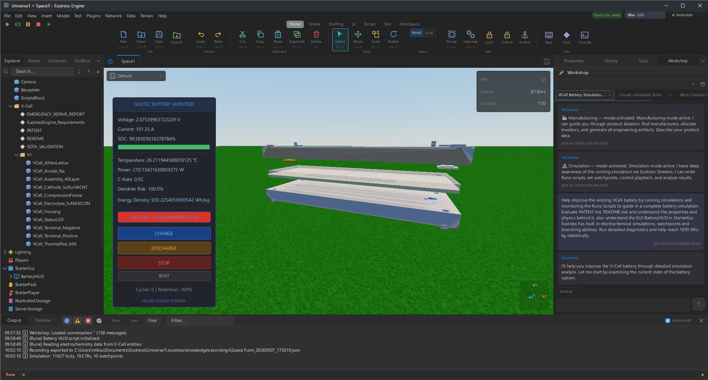

# Eustress Engine

<p align="center">
  
  
  
  
  
  <a href="https://discord.gg/FztQJJacbw"></a>
</p>

> **Design it, prove it, then build it.** An AI-native simulation and data platform that models the real world in real units, so you can find the failure before it costs you steel, capital, or a recall.

<p align="center">
  
</p>

<p align="center"><em>The Eustress Engine studio in action: a native Bevy 3D viewport running a live <strong>V-Cell</strong> battery-monitor simulation, alongside the scene Explorer, real-time Properties, and the built-in <strong>AI Workshop</strong> assistant, all in a single Rust + Slint window.</em></p>

---

## What you can do with it

Most of the world gets built once, at full cost and full risk. Eustress moves that loop into software: design it, stress it to the break point, fix it, and only then commit the steel and the capital.

**Engineer a product end to end.** Model a part in the built-in CAD kernel, give it real materials, run first-principles physics across a dozen domains, and watch where it deforms, overheats, or fails. Every length is a real meter and every law is unit-correct, so the result maps to the thing you will actually machine.

**Run the design loop in software before hardware.** Simulate the system in the loop, iterate until the design holds, and carry the same model forward into physical testing. Software-in-the-loop is where a design gets cheap to be wrong.

**Model the supply chain that builds it.** Registries of manufacturers and investors live in your project, and an allocation engine scores capability, certification, capacity, and price to match each product to the right manufacturer and the smallest sufficient investor set. Purchase orders included.

**Turn any data into a model you can see.** Pull from Postgres, Oracle, S3, Azure, Supabase, Firebase, a graph database, GraphQL, REST, or any HTTP endpoint. Load Parquet and CSV. Then chart it in 2D, place it in 3D next to the parts it describes, fit curves, and cluster it.

**Let an AI operate all of it.** The Model Context Protocol bridge gives an agent real hands on a live world: it builds the model, runs the experiment, reads the telemetry, and proposes the next change, with its own camera so it can see what it made.

**Reconfigure the whole studio for your work.** 11 Modes, 72 Disciplines, and over 2,000 tools, from mechanical and electrical engineering to health, civil, legal, government, and business.

---

## Mission

Eustress exists to be the **open substrate for modeling reality**, a world-model engine general enough that _anything you can describe, you can build and run inside it_. Games are the on-ramp; the destination is everything else a simulation can become: training grounds for AI agents, living digital twins of factories and markets, governance and justice models, and laboratories where scientists and engineers validate their own theories against a photoreal, real-time world.

It rests on a single load-bearing bet: **the engine simulates the world rather than rendering a scene.** Render-first engines draw what you tell them to draw; Eustress is built to _compute what would actually happen_, with millions of entities evolving under real, rewritable laws.

And it must be **owned by the people who build it**: source-available, forkable, and merit-paid, so the builders who create the worlds and the engineers who extend the engine capture the value they create instead of renting it back from a landlord.

## Why it's different

- **Meter-native and physically faithful.** Geometry, forces, diffusion, and mechanics compute in real SI units. A simulated part and the machined part share the same numbers.
- **Simulation-first.** Built to drive millions of entities under real kernel-level laws; the design target is order-of-_a-year-of-simulation-per-second_ throughput, not just frames on screen.
- **AI-native from the first line.** A built-in **Workshop** assistant plus an **MCP** bridge let agents inspect, drive, and build inside a _live_ world, from their own independent off-screen camera.
- **Kernel laws: the gold-collar unlock.** Engineers and scientists can rewrite how the engine processes physics, chemistry, and more _at the kernel level_ to validate their **own** models (see the bundled V-Cell solid-state-battery simulation). Lose this and it is just a game engine; this is _the_ unlock.
- **Data-native.** The same studio that builds a world ingests, models, and charts the data that describes it, on the same store and under the same tools.
- **Source-available and forkable.** Read it, fork it, embed it, rewrite it, and sell what you build with it, free until you compete with the engine itself.
- **Photoreal and native.** One Rust window: a native **Bevy** 3D viewport with a declarative **Slint** UI overlay. No web stack, no IPC, no overhead.

## Principles (the non-negotiables)

1. **Source-available and forkable.** Not a slogan, but a velocity thesis: an open community ships faster than any closed team, and closing the source would kill the moat.
2. **The gold-collar unlock.** Engineers and scientists can rewrite the engine's **kernel laws** to validate their _own_ models inside a real-time, photoreal world.
3. **The two-token wall.** Buyer-money and builder-money never share a denomination, and the split that funds builders is **constitutional, not a tunable cut**.
4. **Merit only.** Standing comes from contribution, not connections: a meritocracy, automated and open.

---

## Modes and Disciplines

A **Mode** reconfigures the entire studio for a kind of work: which ribbon tabs appear, the default panel layout, and an accent color. Each Mode carries **Disciplines** that specialize it further. Modes are plain TOML data, so you can copy one, change its `id`, and it appears in the Modes dropdown.

| Mode | Disciplines | Mode | Disciplines |
|---|---|---|---|
| Engineering | 7 (mechanical, electrical, …) | Government | 12 |
| Business | 7 | Health | 6 |
| AI | 7 | Legal | 6 |
| Civil | 9 | Military | 6 |
| Student | 9 | Justice | 3 |
| Gaming | the on-ramp | | |

**11 Modes, 72 Disciplines, and over 2,000 tools.** Add your own by dropping a TOML file in `%LOCALAPPDATA%/Eustress/Modes/`.

## The Studio

- Native **Bevy 3D viewport** with a **Slint** overlay, in a single window with zero IPC
- **Scene Explorer** hierarchy and a **real-time Properties** editor
- **Move / Rotate / Scale** gizmos and smart build tools
- **CAD kernel** (B-rep via `truck`) and half-edge **mesh editing** (extrude, inset, bevel)
- **Kernel-law realism** sections (thermodynamic, electrochemical, and more) attached per entity
- **Terrain**, materials, and photoreal lighting
- **Live AI co-creation**: the Workshop assistant and MCP bridge build alongside you
- Console, undo history, and a timeline

## Data Platform

The same studio that builds a 3D world is also a **data workbench**. A digital twin's telemetry, an experiment's measurements, or a market's history live in the same scene as the parts they describe.

- **Datasets are instances.** A `Dataset` sits in the Explorer alongside `Part` and `Light`, under a `DataService`, nesting `Series` (columns and timeseries) and `Run` (scenarios) the way a Model nests parts.
- **One polymorphic inspector.** Select a Dataset and the same Properties panel that shows a Part's Appearance and Physics shows the data's **Schema**, **Source and provenance**, **live Stats** (n, mean, min/max, σ), and **Storage**.
- **Connect to what you already have.** Connectors for **Postgres**, **Oracle**, **S3**, **Azure**, **Supabase**, **Firebase**, **graph databases**, **GraphQL**, **REST**, and raw **HTTP**, plus **Parquet** and **CSV** files, so partner data and your own systems land in one model.
- **See it in 2D and 3D.** Auto-scaling interactive charts with point hover, least-squares fits and their equations, Chart / Grid / Split views, and a spreadsheet-style Data Grid, next to the 3D scene the data describes.
- **Analysis built in.** The `eustress-data` crate (Polars and Arrow backed) supplies stats, curve fits, and clustering (k-means, kNN) that the **Data** ribbon runs on the selected Dataset.
- **Provenance and export.** Content-addressed provenance records and a verifiable manifest, with export paths including HuggingFace data cards.

It is **domain-agnostic**: nothing about a factory line, a portfolio, or a genome is baked into the engine.

## From design to manufacture

Eustress carries a product from the first sketch to the purchase order.

- **Design and simulate.** CAD geometry, real materials, and first-principles physics across a dozen domains, all meter-native.
- **Software in the loop.** Iterate the system against simulated physics until the design holds, where being wrong is cheap.
- **Match the supply base.** The Manufacturing Program keeps two registries in your project: **manufacturers** (capabilities, certifications, capacity, pricing tiers, quality) and **investors** (focus, capacity, terms, track record). An allocation engine scores capability matches and assigns the optimal single manufacturer and the minimum sufficient investor set per product.
- **Order it.** Purchase orders are first-class, and the registry is Space-local, because a supply base varies per project.

## AI-native

- **Workshop.** A built-in assistant that co-creates inside the running studio.
- **MCP bridge.** External agents (Claude and others) discover entities, author and execute Rune or Luau scripts, run experiments with git branching, capture camera frames, tail telemetry, and compare runs.
- **Independent AI camera.** The agent can observe the simulation even when no human viewport is open, so it can see its own work and iterate.
- **Scriptable.** Rune (safety and performance) and Luau (expressiveness), both hot-reloadable.

---

## Architecture

| Layer | Choice |
|---|---|
| Language | 100% Rust |
| Render core | Bevy 0.19 |
| UI | Slint (declarative, native) |
| Physics | Avian |
| World store | Binary, log-structured **WorldDb** on [Fjall](https://github.com/fjall-rs/fjall) (LSM-tree), holding live entity state as compact records so a world scales to millions of entities and loads fast |
| Analytics | Polars / Arrow |
| Platforms | Desktop (Windows, macOS, Linux); mobile player in progress |

Eustress is a Rust monorepo. The most important crates (`eustress/crates/`):

| Crate | Role |
|---|---|
| `engine` | Desktop 3D studio: viewport, Explorer, Properties, build and transform tools, Modes |
| `client` · `player-mobile` | Generative player / renderer |
| `common` | Shared scene format, instance classes, services, units, and realism / kernel laws |
| `worlddb` · `eustress-fjall` | Binary simulation store (the Fjall LSM-tree `WorldDb`) |
| `data` | Data Platform: columnar frames, connectors, stats, curve fits, clustering, provenance |
| `mcp` · `mcp-server` | Model Context Protocol, letting AI inspect and drive the live engine |
| `workshop` | Built-in AI Workshop assistant |
| `cad` | CAD / B-rep kernel (via `truck`) |
| `mesh-edit` | Half-edge mesh editing (extrude, inset, …) |
| `embedvec` · `spatial-llm` | Vector + spatial AI |
| `stream` · `stream-node` | Real-time streaming |
| `bliss` · `identity` · `server` · `web` | Economy, identity, backend, and web surfaces |

## Prerequisites

- Rust (latest stable) and Cargo

## Quick start

```bash
cd eustress

# Run the studio (editor)
cargo run-studio

# Run the player (generative client)
cargo run-client
```

There is also a helper script: `./build-and-run.ps1 engine` (or `client`).

### Production build

```bash
cd eustress
cargo build --workspace --release      # binaries → eustress/target/release/
```

## Project structure

```
eustress/                  # Cargo workspace
├── Cargo.toml
├── crates/
│   ├── engine/            # Desktop studio (viewport, Modes, tools)
│   ├── client/            # Player / renderer
│   ├── common/            # Scene format, classes, kernel laws
│   ├── worlddb/           # Binary WorldDb trait
│   ├── eustress-fjall/    # Fjall LSM-tree backend
│   ├── data/              # Data Platform: connectors, frames, stats, fits
│   ├── mcp-server/        # MCP server (AI tooling)
│   ├── workshop/          # AI Workshop assistant
│   ├── cad/  mesh-edit/   # CAD + mesh kernels
│   └── …                  # embedvec, spatial-llm, stream, bliss, identity, web, …
├── assets/
└── docs/
```

## The economy that pays its builders

Eustress is designed so contribution converts to income **without the platform skimming**, a real labor market rather than a company store:

- **Two-token wall.** **Tickets** (bought in USD, spent across the publication gallery) are buyer-money; **Bliss** (earned through contribution, cash-outable to USD) is builder-money. They never share a denomination.
- **Constitutional 50/50.** Half of every Ticket dollar structurally funds builders, half funds the engine, written into how the tokens work rather than left as a cut the platform can quietly change later.
- **Merit-only ladder.** Install the engine, contribute, earn rank, become a Contributor, earn Bliss, publish, and cash out.

## Contributing

Eustress is source-available and merit-based; that is the velocity thesis, not a slogan. Install it, find something that bugs you, and open a PR. Contribution is the on-ramp to the ladder above; rank and Bliss follow the work.

## License

Eustress is **dual-licensed**:

- **[PolyForm Shield License 1.0.0](LICENSE)** — free for everyone, forever. Use it, modify it, fork it, ship and **sell what you build with it** at no cost and with no royalty. The single restriction: you may not use Eustress to provide a product that **competes with Eustress itself** (e.g. reselling the engine, editor, or platform as your own).
- **[Eustress Commercial License](LICENSE-COMMERCIAL.md)** — a paid, negotiated license for organizations that need rights beyond the Shield grant: competitive-use rights, perpetual version grants, warranties, indemnification, or support SLAs. Contact **licensing@eustress.dev**.

If your product is built *with* Eustress rather than being a substitute *for* Eustress, the free license covers you completely.

> Third-party dependencies (Bevy, Slint, and other crates) retain their own permissive licenses (MIT / Apache-2.0).
